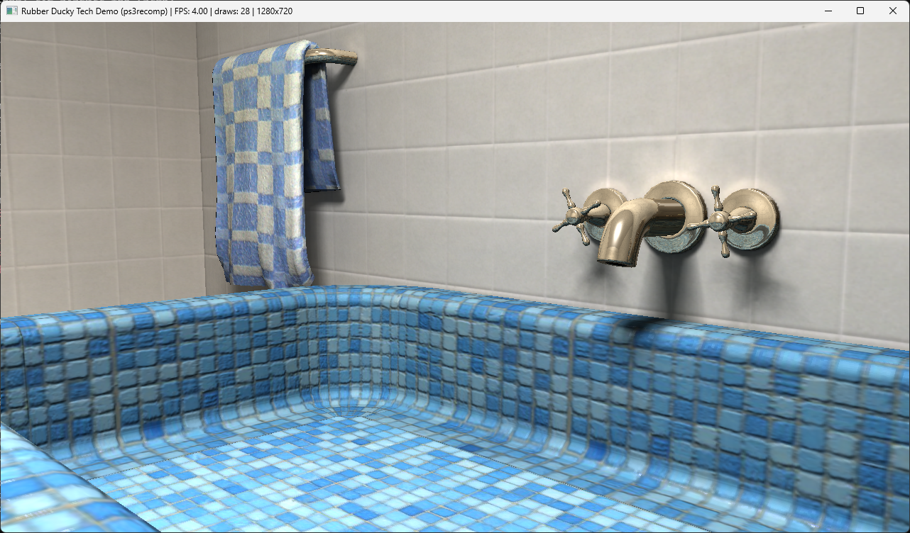

# Rubber Ducky Tech Demo — Static Recompilation

> A native PC port of Sony's *Bigduck* E3 2006 tech demo, rebuilt from the PS3 binary through static recompilation.



The **Rubber Ducky** (internally *Bigduck*) demo was one of the first pieces of PS3 tech Sony showed publicly — a bathtub full of rubber ducks and toy boats bobbing on simulated water, shown at E3 2006 to sell the PlayStation 3's RSX + Cell horsepower. It later shipped as a downloadable SDK sample (`NPEA00003`). It never received a standalone PC release.

This project takes the demo's PS3 `EBOOT` binary, disassembles every PowerPC function, lifts them to C++, and links against [ps3recomp](https://github.com/sp00nznet/ps3recomp) — HLE runtime libraries that replace the PS3 operating system with native host implementations. The result is a standalone Windows executable, no emulator required.

The demo ships as a **debug build with a full symbol table and DWARF** — a rare luxury for a PS3 port. All 8,530 recompiled functions carry their real names (`_jsGcmAllocateMemory`, `gmmAllocFixed`, `spu_memcpy_elf`, …), which makes the lifted code and every crash backtrace directly readable.

## Status

The demo boots, runs its own code, and **renders its own scene**: tiled walls, the blue mosaic tub, the checkered towel, the chrome faucet, and the rubber duck. The bathroom above is the port's own output, captured from the running executable.

| | |
|---|---|
| Title | Rubber Ducky / *Bigduck* Sample (`NPEA00003`) |
| Engine | Sony Cell graphics sample (jsGcm / PSGL "debugrsx", Gmm allocator) |
| ELF | ET_EXEC, PowerPC64 big-endian, self-contained — **debug build**, 8,582-symbol `.symtab` |
| Functions lifted | 13,484 emitted from 8,530 detected (99.0% recall vs. `.symtab`) |
| Target | Windows x86-64 (clang-cl + Ninja) |
| Renders | Scene geometry, textures, cube maps, the duck |
| Not yet | The simulated water surface — see [Known Issues](docs/STATUS.md#known-issues) |

Roughly 4–5 fps with the SPU simulation running (about 16 M interpreted SPU instructions per frame on one thread), or ~12 fps without it.

Full per-phase detail lives in **[docs/STATUS.md](docs/STATUS.md)**.

## Quick start

You must supply your own legally obtained copy of the demo — this repo contains no game binary or assets.

```bash
# ps3recomp checked out alongside this repo, on the research/proto-builds branch
cmake -S ../ps3recomp -B ../ps3recomp/build -G Ninja -DCMAKE_BUILD_TYPE=Release \
      -DCMAKE_C_COMPILER=clang-cl -DCMAKE_CXX_COMPILER=clang-cl
cmake --build ../ps3recomp/build

# generate the lifted C++ from your own EBOOT, then build the harness
#   (full sequence: docs/PIPELINE.md)
cmake -S . -B build -G Ninja -DCMAKE_C_COMPILER=clang-cl -DCMAKE_CXX_COMPILER=clang-cl
cmake --build build

PS3_VFS_ROOT=input RD_SPU_INTERP=1 RT_DISPLAY_BY_SIZE=1 TEX_OFF_BIAS=3 RSX_ACCUM_FRAME=1 \
  ./build/rubberducky input/EBOOT.elf
```

The full reproducible pipeline — SELF carve, analysis, symbol extraction, NID table, lifting, post-lift patches — is in **[docs/PIPELINE.md](docs/PIPELINE.md)**.

### Prerequisites

- Python 3.9+
- CMake 3.20+, Ninja
- LLVM/clang-cl 14+ (the loader uses `__builtin_bswap` and weak symbols MSVC lacks)
- A Visual Studio 2022 dev environment (MSVC headers + Windows SDK for clang-cl)
- [ps3recomp](https://github.com/sp00nznet/ps3recomp) on the `research/proto-builds` branch, at `../ps3recomp`

## Project structure

```
rubberducky/
├── README.md
├── LICENSE
├── CMakeLists.txt          # links the runtime + the generic boot harness
├── config.toml             # analysis-driven pipeline config
├── docs/                   # status, pipeline, changelog
├── input/                  # your own EBOOT.elf + USRDIR assets (gitignored)
├── meta/                   # analysis outputs, regenerated from your ELF (gitignored)
├── tools/
│   ├── post_lift.py        # idempotent post-lift patches (allocator override)
│   └── symrva.py
└── src/
    ├── boot_main.cpp       # ps3recomp boot harness, rebranded for this title
    ├── rd_malloc.cpp       # guest heap override (bump allocator)
    ├── rd_spu.cpp          # raw-SPU MMIO / MFC proxy DMA
    ├── compat/             # <dirent.h>/<unistd.h> Win32 shims
    ├── gen/                # generated HLE NID table (committed)
    └── recomp/             # lifted C++, ~105 MB (gitignored; regenerate)
```

## Documentation

- **[docs/STATUS.md](docs/STATUS.md)** — per-phase progress, what works, known issues
- **[docs/PIPELINE.md](docs/PIPELINE.md)** — the reproducible build pipeline and how it fits together
- **[docs/CHANGELOG.md](docs/CHANGELOG.md)** — release history

## Related projects

- **[ps3recomp](https://github.com/sp00nznet/ps3recomp)** — the PS3 HLE runtime this builds against
- **[N64Recomp](https://github.com/N64Recomp/N64Recomp)** — the project that proved static recompilation works at scale

## Legal

This project contains no proprietary Sony code, game binaries, encryption keys, or copyrighted assets. It is a clean-room reimplementation of PS3 system libraries paired with automated binary-translation tools. Everything derived from the demo's own binary — the lifted C++ under `src/recomp/`, the analysis JSON under `meta/`, and the extracted SPU images — is generated locally from a copy you supply and is not committed here.

Licensed under the [MIT License](LICENSE).
